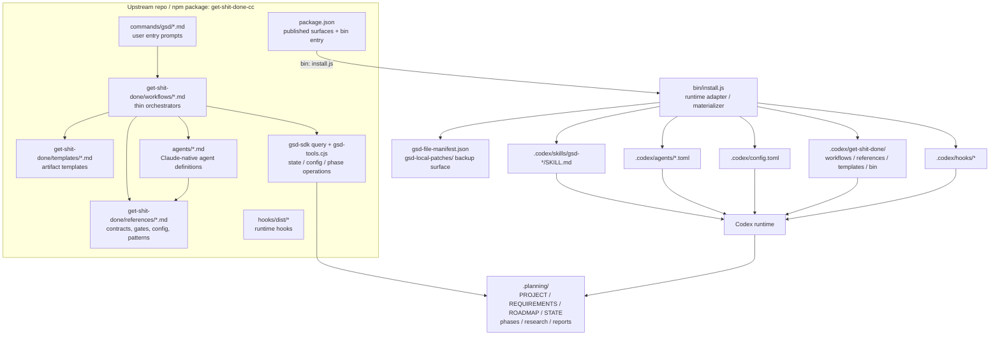
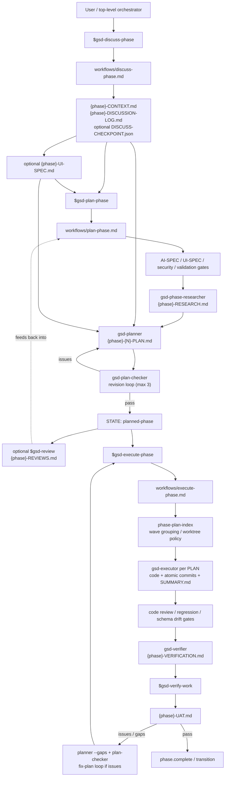

# Checkpoint 5: Upstream GSD Baseline Schema

## Research Frame
- Mode: `terrain mapping`
- Question: What is the upstream `get-shit-done-cc` / `gsd-build/get-shit-done` architecture for the Codex-facing runtime surfaces that matter to this repo's local GSD install?
- Scope: Upstream package structure, installer/materialization path, workflow family, agent/contracts layer, references/templates, discovery rules, and emitted planning artifacts. Local repo context is used only to identify comparison surfaces.
- Non-goals: Recommending local changes, exhaustively documenting all 75 commands, or treating current repo-local `.codex/` contents as upstream truth.
- Stop condition: A comparison-ready baseline exists that can distinguish upstream package truth from repo-local overlay, wrapper, and readiness-only intervention layers.

## Path Of Inquiry
- Entry point: upstream [`package.json`](https://github.com/gsd-build/get-shit-done/blob/main/package.json#L2-L15), [`docs/ARCHITECTURE.md`](https://github.com/gsd-build/get-shit-done/blob/main/docs/ARCHITECTURE.md#L22-L65), and [`bin/install.js`](https://github.com/gsd-build/get-shit-done/blob/main/bin/install.js#L24-L36).
- Branches considered: package contents, Codex install adaptation, workflow family docs, agent/handoff contracts, skill discovery rules, Codex-specific tests, and the local portable-install wrapper.
- Branches pursued: upstream architecture docs; `install.js` Codex path; `discuss/plan/execute/review/verify` workflow files; `agent-contracts.md`; `planning-config.md`; discovery contract; Codex/unit tests; local [scripts/setup-portable-gsd.sh](/home/rookslog/workspace/projects/prix-guesser/scripts/setup-portable-gsd.sh:10) and [AGENTS.md](/home/rookslog/workspace/projects/prix-guesser/AGENTS.md:5).
- Branches deferred or abandoned: full per-command audit, non-Codex runtime comparison, and full diffing of `tooling/portable-gsd/overlay/`.
- Unexpected branches / reframings: upstream docs present both `Total agents: 31` in architecture and `All 21 specialized agents` in the agent reference, so some upstream counts should be treated as section-scoped rather than globally canonical until independently re-counted.[^arch][^agents]

## Assumptions Surfaced
- [a:r:d] For Codex, upstream truth is best modeled as `Claude-native source tree -> install-time runtime translation -> materialized .codex runtime tree`, not as a separate Codex-authored source tree.[^arch][^install][^codex-tests]
- [a:r:i] This repo's current `.codex/` tree cannot be assumed to represent raw upstream output because the local install wrapper runs upstream install first, then applies an overlay and reasoning-effort rewrites.[^local-install]
- [a:r:d] Where prose and behavior differ, upstream tests are the stronger contract surface for Codex adaptation details such as tool mapping, config merge behavior, hook installation, and skill conversion.[^codex-tests][^count-tests]

## Option Space / Comparison Lenses
- Source-package lens: what upstream publishes and maintains directly (`bin`, `commands`, `get-shit-done`, `agents`, `hooks`, `scripts`).[^pkg]
- Materialization lens: how `bin/install.js` rewrites those sources into Codex-local `skills/`, `agents/*.toml`, `config.toml`, `hooks/`, and manifest/patch metadata.[^install]
- Workflow-contract lens: how the discuss/plan/execute/review/verify family consumes and emits `.planning` artifacts across phase boundaries.[^arch][^commands][^discuss][^plan][^execute][^verify][^review][^contracts]
- Local-intervention lens: which repo-local differences are overlay/materialization changes, wrapper rewrites, runtime-policy overlays, or readiness-only analysis artifacts rather than upstream source divergence.[^local-install]

## Evidence Base
### Direct evidence
- [e:c:d] The npm package is `get-shit-done-cc`; its published file set is `bin`, `commands`, `get-shit-done`, `agents`, `hooks`, and `scripts`; its executable entry is `bin/install.js`.[^pkg]
- [e:c:d] Upstream architecture docs model GSD as `commands -> workflows -> agents -> CLI tools -> .planning`, with Codex treated as a runtime where commands become skills and config lives under `~/.codex/`.[^arch]
- [e:c:d] The Codex install path is explicitly runtime-adapted in `install.js`: Codex uses `.codex`, resolves config via `--config-dir > CODEX_HOME > ~/.codex`, writes skill directories from commands, generates per-agent TOML, merges `config.toml`, copies hooks, and writes manifest/patch metadata.[^install]
- [e:c:d] The core workflow family explicitly emits phase artifacts: `CONTEXT.md`, `DISCUSSION-LOG.md`, `RESEARCH.md`, `PLAN.md`, `SUMMARY.md`, `VERIFICATION.md`, `UAT.md`, and `REVIEWS.md`.[^commands][^discuss][^plan][^execute][^verify][^review]
- [e:c:d] `agent-contracts.md` formalizes the handoff fields and completion markers that make the planner/checker/executor/verifier chain machine-readable.[^contracts]
- [e:c:d] `discovery-contract.md` establishes `.codex/skills/` as a project root and `~/.codex/skills/` as a managed global root, with distinct scanning behavior for inventory vs. project profile output.[^discovery]
- [e:c:i] This repo's local install wrapper invokes `npx get-shit-done-cc --codex --local`, applies a tracked overlay into `.codex/`, then rewrites `model_reasoning_effort` defaults in `config.toml` and multiple agent TOMLs.[^local-install]

### Inference and interpretation
- [e:r:d] Upstream GSD is structurally a runtime-agnostic source package plus an install-time adapter, not a Codex-first codebase. For local comparison, the main question is therefore not "what does upstream `.codex/` look like in repo?" but "what does upstream `install.js` synthesize for Codex from the canonical source tree?"[^arch][^install]
- [e:r:d] The most comparison-sensitive seam is the install/materialization boundary, because that is where command syntax, path rewriting, sandbox defaults, hooks, config merge rules, and agent formats stop being source-truth and become runtime-specific derived artifacts.[^install][^codex-tests]
- [e:r:d] The upstream artifact chain is the stable comparison backbone for local intervention analysis: even if local wrappers or overlays change runtime behavior, any divergence should still be mapped back to whether it changes command semantics, workflow orchestration, handoff contracts, or only generated runtime packaging.[^commands][^contracts]

### Unknowns
- [o:c:d] Upstream docs present an internal count tension: `docs/ARCHITECTURE.md` says `Total agents: 31`, while `docs/AGENTS.md` still brands itself as `All 21 specialized agents`. This baseline does not resolve that discrepancy by re-counting `agents/` on disk.[^arch][^agents]
- [o:r:d] This pass did not classify every file under `tooling/portable-gsd/overlay/`, so the exact local overlay footprint remains open.
- [o:r:d] This pass maps upstream `main`; it does not verify whether the locally installed package version or generated `.codex/` tree is byte-for-byte aligned with that head revision.

## Upstream Orientation
Upstream GSD is a spec-and-workflow package whose canonical authored surfaces are prompt files, references, templates, and agent definitions; `.planning/` is the persistent state substrate, while runtime-specific trees are generated by the installer rather than hand-authored in parallel.[^arch][^pkg]

For Codex specifically, upstream does not maintain a separate source tree of first-class Codex skills and agents. Instead, `install.js` translates command Markdown into `skills/gsd-*/SKILL.md`, rewrites agent Markdown into `.toml` role configs with Codex sandbox settings, merges a managed block into `config.toml`, rewrites `.claude` paths toward `.codex`, and copies the required hooks and support files.[^install][^codex-tests]

The main workflow family remains upstream-authored in `get-shit-done/workflows/*.md`; those orchestrators depend on shared references/templates and emit a durable artifact chain in `.planning/` that downstream stages consume.[^arch][^commands][^discuss][^plan][^execute][^verify][^review][^contracts]

## Upstream Topology Diagram

## Core Workflow / Call Flow Diagram

## Dependencies And Relations
| Item | Depends on | Constrains or affects | Vulnerability |
| --- | --- | --- | --- |
| Codex skill layer | `commands/gsd/*.md` + `convertClaudeCommandToCodexSkill()` | user entry syntax, AskUserQuestion/Task mapping, skill discovery | local `SKILL.md` edits can drift from upstream command semantics |
| Codex agent layer | `agents/*.md` + `generateCodexAgentToml()` + `CODEX_AGENT_SANDBOX` | sandbox profile, agent role text, model embedding | local TOML rewrites can diverge from upstream-tested adapter behavior |
| Workflow family | `get-shit-done/workflows/*.md` + shared references/templates | artifact chain, revision loops, gates, phase transitions | wrapper or local policy can change sequencing without changing upstream workflow source |
| `.planning` artifact chain | workflow init handlers + contract docs + templates | what counts as canonical phase state | readiness audits can be mistaken for runtime state if not kept separate |
| Discovery / inventory | discovery contract + scanner implementations | what `gsd-*` skills are visible locally/globally | local overlay or missing install roots can make availability appear like source drift |

## Upstream Contract Matrix
| Surface | Role | Reads / expects | Emits / returns | Downstream consumers |
| --- | --- | --- | --- | --- |
| `package.json` | Package truth: shipped surfaces and install entrypoint | npm runtime, Node >= 22 | `get-shit-done-cc -> bin/install.js`; published dirs | installer, package consumers |
| `bin/install.js` | Runtime adapter / materializer | package source tree, runtime flags, config dir env vars, existing user config | generated runtime tree, merged config, hooks, manifests, patch backups | Codex runtime, uninstall/reapply flows |
| `commands/gsd/*.md` | User-facing command prompts | command args, runtime-specific install adapter | Codex `skills/gsd-*/SKILL.md`; other runtimes get slash commands / skills | users, runtime command dispatch |
| `docs/skills/discovery-contract.md` plus scanners | Skill discovery contract | project roots, managed global roots, `SKILL.md` directories | normalized skill inventory shape | `skill-manifest`, profile output, project-skill awareness |
| `workflows/discuss-phase.md` | Decision capture orchestrator | phase selection, roadmap/canon, prior context, optional checkpoint JSON | `CONTEXT.md`, `DISCUSSION-LOG.md`, commit, optional chain to plan | `gsd-phase-researcher`, `gsd-planner`, later phase steering |
| `templates/context.md` | Canonical structure for phase context | roadmap boundary plus discussion outputs | standardized sections: boundary, decisions, specifics, canonical refs, code context, deferred ideas | researcher, planner, humans reviewing phase intent |
| `workflows/plan-phase.md` | Research-plan-verify orchestrator | `CONTEXT.md`, optional UI/AI/security inputs, config flags | `RESEARCH.md`, `PLAN.md`, `VALIDATION.md`, `STATE planned-phase` | executor, plan checker, review, verification |
| `references/agent-contracts.md` | Formal handoff contract | agent outputs, markers, artifact schema | completion markers, required PLAN/SUMMARY fields, regex expectations | orchestrators, verifier/checker loops |
| `workflows/execute-phase.md` | Phase execution orchestrator | `PLAN.md`, config flags, worktree policy, plan index, cross-AI settings | code, commits, `SUMMARY.md`, `VERIFICATION.md`, phase completion state | `verify-work`, transition, later audits |
| `workflows/review.md` | External review orchestrator | phase prompts/artifacts plus available external CLIs | `REVIEWS.md` | `/gsd-plan-phase --reviews`, human steering |
| `workflows/verify-work.md` | Conversational UAT loop | `SUMMARY.md`, existing UAT state, user test outcomes | `UAT.md`, gap diagnoses, optional fix plans | planner gap-closure loop, phase completion |
| `tests/codex-config.test.cjs` and related tests | Regression contract for Codex adaptation and doc sync | installer helpers, config merge paths, docs counts | pass/fail on adapter semantics and sync invariants | maintainers; downstream users who rely on adapter behavior staying stable |

## Comparison-Ready Delta Classes
### 1. Overlay / materialization divergence
- [e:c:d+i] Upstream Codex install materializes generated runtime assets under `.codex/` from canonical package sources: skill dirs, per-agent TOML, merged `config.toml`, copied hooks, and manifest/patch metadata.[^install]
- [e:c:i] This repo then layers its own tracked overlay on top of the generated `.codex/` tree after upstream install completes, with project-root path substitution during copy.[^local-install]
- Comparison consequence: any local file inside `.codex/` must first be classified as `upstream-generated`, `repo-overlayed`, or `upstream-generated then locally rewritten` before calling it a source divergence.

### 2. Local wrapper edits
- [e:c:d+i] Upstream already supports Codex-specific model embedding and config merge rules, but those come from installer logic and optional global defaults rather than repo-specific reasoning tiers.[^install][^codex-tests]
- [e:c:i] This repo's wrapper immediately rewrites the top-level `model_reasoning_effort` and a curated set of agent TOML reasoning levels after installation.[^local-install]
- Comparison consequence: reasoning-tier drift is a local wrapper layer unless the underlying upstream adapter or agent prompts also changed.

### 3. Local runtime-only policy changes
- [e:c:d] Upstream models Codex as a generic skill-based runtime and includes adapter semantics for Claude-style prompt concepts such as `AskUserQuestion` and `Task()`.[^arch][^codex-tests]
- [e:c:i] This repo imposes extra orchestration doctrine on top: repo-local GSD only, top-level orchestration only, explicit task classification before agent spawn, and repo-specific model/reasoning policy.[^local-runtime]
- Comparison consequence: some local behavior changes may be intentional repo policy overlays rather than evidence that upstream package structure was changed.

### 4. Package-truth vs readiness-only surfaces
- [e:c:d] Upstream package truth is bounded by the published package surfaces and the runtime artifacts the installer knows how to write.[^pkg][^install]
- [e:c:i] This audit lives under `.planning/readiness/phase-01-rerun/AUDITS/`, which is a repo-local analysis lane and not an upstream runtime surface.[^local-runtime]
- Comparison consequence: readiness audits, rerun checkpoints, and local planning diagnostics should be treated as comparison scaffolding, not as candidates for "upstream sync" unless they imply changes to actual runtime/package surfaces.

### 5. Contract-surface divergence
- [e:c:d] Upstream's stable interoperability surfaces are not just files but contracts: command syntax, workflow entry/exit artifacts, agent completion markers, and discovery/inventory rules.[^commands][^contracts][^discovery]
- Comparison consequence: a local intervention that leaves generated file names untouched can still be meaningfully divergent if it changes handoff semantics, required reads, or emitted artifact structure.

## Questions This Baseline Can Answer For Local Intervention Analysis
- Which parts of a fresh `.codex/` tree should exist after a pure upstream `npx get-shit-done-cc --codex --local` install?
- Which local `.codex/` files are source-authored upstream vs generated at install time?
- Which Codex surfaces are converted from Claude-native prompts rather than maintained as independent Codex-first artifacts?
- Where do workflow outputs become formal contracts rather than incidental docs?
- Which local diffs should be attributed to `install.js`, to repo overlay/materialization, to repo runtime policy, or to readiness-only analysis work?
- Which local changes are likely to conflict with upstream-tested Codex invariants such as config merge behavior, sandbox mapping, hook install, or tool adapter semantics?
- Which artifact names and handoff expectations can be used as the stable backbone for a later file-by-file local/upstream delta audit?

## Scope Expansions And Deferrals
- Deferred: full audit of `tooling/portable-gsd/overlay/` contents.
- Deferred: byte-level diff of generated local `.codex/` runtime assets against a clean upstream Codex install.
- Deferred: non-Codex runtime comparison and broader cross-runtime topology analysis.

## What Can Close Now
- [e:c:d] Upstream GSD for Codex is structurally a two-stage system: canonical source package first, runtime-specific materialization second.[^arch][^install]
- [e:c:d] The comparison backbone for local intervention analysis should be the artifact and contract chain `CONTEXT -> RESEARCH -> PLAN -> SUMMARY -> VERIFICATION -> UAT`, plus optional `REVIEWS` and UI/AI/security side-contracts.[^commands][^discuss][^plan][^execute][^verify][^review][^contracts]
- [e:c:i] This repo's current local install path is explicitly not a raw upstream install; it is upstream install plus overlay plus reasoning rewrites.[^local-install]

## What Must Stay Open
- [o:r:d] Exact overlay scope remains open until `tooling/portable-gsd/overlay/` is classified file-by-file.
- [o:r:d] Exact generated-local-vs-upstream drift remains open until a clean local install baseline is re-materialized and diffed.
- [o:c:d] Upstream agent-count documentation drift remains unresolved in this pass.[^arch][^agents]

## Sources
### Local comparison sources
- [scripts/setup-portable-gsd.sh](/home/rookslog/workspace/projects/prix-guesser/scripts/setup-portable-gsd.sh:11)
- [AGENTS.md](/home/rookslog/workspace/projects/prix-guesser/AGENTS.md:39)

## External Works Cited
[^pkg]: Upstream [`package.json`](https://github.com/gsd-build/get-shit-done/blob/main/package.json#L2-L15), lines 2-15 for package identity and published surfaces, plus lines 46-50 for build/test scripts.
[^arch]: Upstream [`docs/ARCHITECTURE.md`](https://github.com/gsd-build/get-shit-done/blob/main/docs/ARCHITECTURE.md#L22-L65), `System Overview` lines 22-65; [`Component Architecture`](https://github.com/gsd-build/get-shit-done/blob/main/docs/ARCHITECTURE.md#L105-L170), lines 105-170; [`Data Flow`](https://github.com/gsd-build/get-shit-done/blob/main/docs/ARCHITECTURE.md#L326-L402), lines 326-402; [`Installer Architecture`](https://github.com/gsd-build/get-shit-done/blob/main/docs/ARCHITECTURE.md#L490-L512), lines 490-512; [`Runtime Abstraction`](https://github.com/gsd-build/get-shit-done/blob/main/docs/ARCHITECTURE.md#L576-L601), lines 576-601.
[^install]: Upstream [`bin/install.js`](https://github.com/gsd-build/get-shit-done/blob/main/bin/install.js#L24-L36), lines 24-36 for `CODEX_AGENT_SANDBOX`; [lines 138-145](https://github.com/gsd-build/get-shit-done/blob/main/bin/install.js#L138-L145) for `.codex` dir mapping; [lines 274-282](https://github.com/gsd-build/get-shit-done/blob/main/bin/install.js#L274-L282) for Codex config-dir resolution; [lines 1772-1803](https://github.com/gsd-build/get-shit-done/blob/main/bin/install.js#L1772-L1803) for per-agent TOML generation; [lines 1809-1824](https://github.com/gsd-build/get-shit-done/blob/main/bin/install.js#L1809-L1824) for Codex config block generation; [lines 3003-3041](https://github.com/gsd-build/get-shit-done/blob/main/bin/install.js#L3003-L3041) for `installCodexConfig`; [lines 3634-3680](https://github.com/gsd-build/get-shit-done/blob/main/bin/install.js#L3634-L3680) for command-to-skill conversion; [lines 5248-5260](https://github.com/gsd-build/get-shit-done/blob/main/bin/install.js#L5248-L5260) for manifest writing; [lines 5479-5507](https://github.com/gsd-build/get-shit-done/blob/main/bin/install.js#L5479-L5507) for Codex skill install path; [lines 5924-5958](https://github.com/gsd-build/get-shit-done/blob/main/bin/install.js#L5924-L5958) for Codex config and hook copy.
[^commands]: Upstream [`docs/COMMANDS.md`](https://github.com/gsd-build/get-shit-done/blob/main/docs/COMMANDS.md#L11-L205), line 11 for Codex syntax, lines 91-116 for `discuss-phase`, lines 138-167 for `plan-phase`, lines 172-191 for `execute-phase`, lines 196-208 for `verify-work`, plus [lines 1121-1144](https://github.com/gsd-build/get-shit-done/blob/main/docs/COMMANDS.md#L1121-L1144) for `review`.
[^discuss]: Upstream [`get-shit-done/workflows/discuss-phase.md`](https://github.com/gsd-build/get-shit-done/blob/main/get-shit-done/workflows/discuss-phase.md#L14-L20), lines 14-20 for `CONTEXT.md` downstream consumers; [lines 242-283](https://github.com/gsd-build/get-shit-done/blob/main/get-shit-done/workflows/discuss-phase.md#L242-L283) for existing-context/checkpoint handling; [lines 449-456](https://github.com/gsd-build/get-shit-done/blob/main/get-shit-done/workflows/discuss-phase.md#L449-L456) for canonical refs accumulation; [lines 882-918](https://github.com/gsd-build/get-shit-done/blob/main/get-shit-done/workflows/discuss-phase.md#L882-L918) for checkpoint writes/resume; [lines 930-949](https://github.com/gsd-build/get-shit-done/blob/main/get-shit-done/workflows/discuss-phase.md#L930-L949) for `CONTEXT.md`; [lines 1110-1163](https://github.com/gsd-build/get-shit-done/blob/main/get-shit-done/workflows/discuss-phase.md#L1110-L1163) for `DISCUSSION-LOG.md` and commit; [lines 1185-1198](https://github.com/gsd-build/get-shit-done/blob/main/get-shit-done/workflows/discuss-phase.md#L1185-L1198) for auto-advance behavior.
[^plan]: Upstream [`get-shit-done/workflows/plan-phase.md`](https://github.com/gsd-build/get-shit-done/blob/main/get-shit-done/workflows/plan-phase.md#L1-L20), lines 1-20 for purpose and spawned agents; [lines 30-33](https://github.com/gsd-build/get-shit-done/blob/main/get-shit-done/workflows/plan-phase.md#L30-L33) for init; [lines 248-280](https://github.com/gsd-build/get-shit-done/blob/main/get-shit-done/workflows/plan-phase.md#L248-L280) for AI-SPEC gate; [lines 404-409](https://github.com/gsd-build/get-shit-done/blob/main/get-shit-done/workflows/plan-phase.md#L404-L409) for `VALIDATION.md`; [lines 418-437](https://github.com/gsd-build/get-shit-done/blob/main/get-shit-done/workflows/plan-phase.md#L418-L437) for security enforcement; [lines 463-502](https://github.com/gsd-build/get-shit-done/blob/main/get-shit-done/workflows/plan-phase.md#L463-L502) for UI-SPEC gate; [lines 680-907](https://github.com/gsd-build/get-shit-done/blob/main/get-shit-done/workflows/plan-phase.md#L680-L907) for planner/checker spawns; [lines 945-996](https://github.com/gsd-build/get-shit-done/blob/main/get-shit-done/workflows/plan-phase.md#L945-L996) for revision loop; [lines 1081-1144](https://github.com/gsd-build/get-shit-done/blob/main/get-shit-done/workflows/plan-phase.md#L1081-L1144) for coverage gate and planned-state update.
[^execute]: Upstream [`get-shit-done/workflows/execute-phase.md`](https://github.com/gsd-build/get-shit-done/blob/main/get-shit-done/workflows/execute-phase.md#L1-L21), lines 1-21 for purpose/runtime notes; [lines 82-94](https://github.com/gsd-build/get-shit-done/blob/main/get-shit-done/workflows/execute-phase.md#L82-L94) for worktree config; [lines 237-329](https://github.com/gsd-build/get-shit-done/blob/main/get-shit-done/workflows/execute-phase.md#L237-L329) for plan index and cross-AI classification; [lines 397-562](https://github.com/gsd-build/get-shit-done/blob/main/get-shit-done/workflows/execute-phase.md#L397-L562) for wave execution and completion fallback; [lines 1008-1219](https://github.com/gsd-build/get-shit-done/blob/main/get-shit-done/workflows/execute-phase.md#L1008-L1219) for code review/regression/schema drift gates; [lines 1219-1437](https://github.com/gsd-build/get-shit-done/blob/main/get-shit-done/workflows/execute-phase.md#L1219-L1437) for verifier and completion routing.
[^verify]: Upstream [`get-shit-done/workflows/verify-work.md`](https://github.com/gsd-build/get-shit-done/blob/main/get-shit-done/workflows/verify-work.md#L1-L10), lines 1-10 for purpose; [lines 56-58](https://github.com/gsd-build/get-shit-done/blob/main/get-shit-done/workflows/verify-work.md#L56-L58) for active UAT sessions; [lines 220-225](https://github.com/gsd-build/get-shit-done/blob/main/get-shit-done/workflows/verify-work.md#L220-L225) for `UAT.md` writes; [lines 490-641](https://github.com/gsd-build/get-shit-done/blob/main/get-shit-done/workflows/verify-work.md#L490-L641) for diagnose/gap planning/checker loop; [lines 705-737](https://github.com/gsd-build/get-shit-done/blob/main/get-shit-done/workflows/verify-work.md#L705-L737) for update rules and fix-plan expectations.
[^review]: Upstream [`get-shit-done/workflows/review.md`](https://github.com/gsd-build/get-shit-done/blob/main/get-shit-done/workflows/review.md#L1-L4), lines 1-4 for purpose; [lines 13-186](https://github.com/gsd-build/get-shit-done/blob/main/get-shit-done/workflows/review.md#L13-L186) for CLI detection and Codex invocation; [lines 240-340](https://github.com/gsd-build/get-shit-done/blob/main/get-shit-done/workflows/review.md#L240-L340) for `REVIEWS.md` synthesis and planner consumption.
[^contracts]: Upstream [`get-shit-done/references/agent-contracts.md`](https://github.com/gsd-build/get-shit-done/blob/main/get-shit-done/references/agent-contracts.md#L9-L79), lines 9-42 for agent registry and marker rules; lines 44-63 for planner/executor/verifier handoff fields; lines 65-79 for workflow regex patterns.
[^discovery]: Upstream [`docs/skills/discovery-contract.md`](https://github.com/gsd-build/get-shit-done/blob/main/docs/skills/discovery-contract.md#L5-L26), lines 5-26 for project/global roots; [lines 50-79](https://github.com/gsd-build/get-shit-done/blob/main/docs/skills/discovery-contract.md#L50-L79) for scanner behavior and inventory shape.
[^agents]: Upstream [`docs/AGENTS.md`](https://github.com/gsd-build/get-shit-done/blob/main/docs/AGENTS.md#L1-L27), lines 1-27 for overview and category count framing; [lines 52-68](https://github.com/gsd-build/get-shit-done/blob/main/docs/AGENTS.md#L52-L68) for `gsd-phase-researcher`; [lines 152-171](https://github.com/gsd-build/get-shit-done/blob/main/docs/AGENTS.md#L152-L171) for `gsd-planner`; [lines 196-215](https://github.com/gsd-build/get-shit-done/blob/main/docs/AGENTS.md#L196-L215) for `gsd-executor`; [lines 219-240](https://github.com/gsd-build/get-shit-done/blob/main/docs/AGENTS.md#L219-L240) for `gsd-plan-checker`; [lines 274-292](https://github.com/gsd-build/get-shit-done/blob/main/docs/AGENTS.md#L274-L292) for `gsd-verifier`.
[^codex-tests]: Upstream [`tests/codex-config.test.cjs`](https://github.com/gsd-build/get-shit-done/blob/main/tests/codex-config.test.cjs#L78-L110), lines 78-110 for skill-adapter header mapping; [lines 118-152](https://github.com/gsd-build/get-shit-done/blob/main/tests/codex-config.test.cjs#L118-L152) for agent conversion expectations; [lines 272-376](https://github.com/gsd-build/get-shit-done/blob/main/tests/codex-config.test.cjs#L272-L376) for TOML and sandbox mapping; [lines 383-520](https://github.com/gsd-build/get-shit-done/blob/main/tests/codex-config.test.cjs#L383-L520) for config-block/merge behavior; [lines 890-915](https://github.com/gsd-build/get-shit-done/blob/main/tests/codex-config.test.cjs#L890-L915) for hook-copy and `codex_hooks` install regression coverage.
[^count-tests]: Upstream [`tests/command-count-sync.test.cjs`](https://github.com/gsd-build/get-shit-done/blob/main/tests/command-count-sync.test.cjs#L1-L93), lines 1-93 for the invariant that architecture command counts must match actual `commands/gsd/*.md`.
[^local-install]: Local comparator [scripts/setup-portable-gsd.sh](/home/rookslog/workspace/projects/prix-guesser/scripts/setup-portable-gsd.sh:11), lines 11-31 for upstream install plus overlay copy and lines 33-87 for reasoning rewrites.
[^local-runtime]: Local comparator [`AGENTS.md`](/home/rookslog/workspace/projects/prix-guesser/AGENTS.md:39), lines 39-45 for repo-local runtime rules, plus [AGENTS.md](/home/rookslog/workspace/projects/prix-guesser/AGENTS.md:96) lines 96-124 for top-level orchestration and model/reasoning policy.
